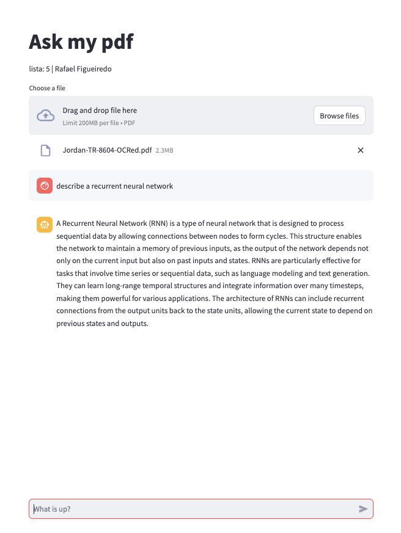

# RAG


## How to setup?

### Install OS requirements
The library [pdftotext](https://pypi.org/project/pdftotext/) requires that we install some OS dependencies:

* Debian, Ubuntu, and friends  
`sudo apt install build-essential libpoppler-cpp-dev pkg-config python3-dev`
* Fedora, Red Hat, and friends  
`sudo yum install gcc-c++ pkgconfig poppler-cpp-devel python3-devel`
* macOS  
`brew install pkg-config poppler python`
* Windows  
Currently tested only when using conda:  
Install the Microsoft Visual C++ Build Tools  
Install poppler through conda:  
`conda install -c conda-forge poppler`


### Install poetry
    ```sh
    pip --upgrade pip
    pip install poetry
    ```

### Install python dependencies
    ```sh
    poetry shell
    poetry install --no-root
    ```

### Setup credentials
Copy the file `.env.example` to `.env`
```sh
cp .env.example .env
```
, and set your own OpenAI keys. 
```.env
OPENAI_API_KEY=sk-1234-asjkdhas
```

## How to run?
Run the following command in the terminal to run the app
```sh
make run
```
Access the app on [http://localhost:8501/](http://localhost:8501/)

